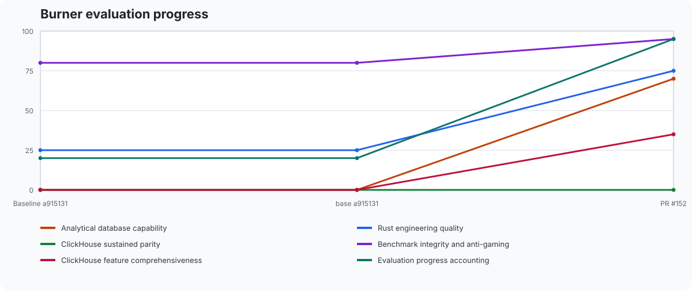

# RustHouse

RustHouse is a from-scratch analytical database in Rust, inspired by the useful core of ClickHouse: typed columnar data, fast scans and aggregations, a practical SQL surface, and an operational interface that is easy to embed and understand.

This is intentionally not a wire-compatible ClickHouse clone. The goal is to grow a credible small competitor through measured, reviewed iterations while keeping the implementation approachable.

## Product target

The first useful release should support:

- typed tables with `Int64`, `Float64`, `Bool`, and `String` columns;
- a genuinely columnar in-memory representation;
- `CREATE TABLE`, `INSERT INTO ... VALUES`, and `SELECT`;
- projections, `WHERE` comparisons, `COUNT`, `countIf`, `SUM`, `MIN`, `MAX`, `AVG`, `GROUP BY`, `ORDER BY`, `LIMIT`, and narrow `OFFSET` pagination;
- a batch/interactive CLI with readable table, CSV, TSV, JSON, JSONEachRow,
  and JSONCompactEachRow output;
- durable local snapshots with an explicit, documented file format;
- an HTTP endpoint for executing SQL;
- deterministic tests and a small benchmark that demonstrate analytical behavior.

The early implementation should favor Rust's standard library and a small dependency surface. Correctness, clear errors, bounded resource use, and a modular path toward vectorized execution matter more than superficial feature count.

## SQL execution

The semicolon-delimited batch engine in `rusthouse::batch` supports typed,
multi-column `Int64`, `Float64`, `Bool`, and `String` tables. It executes
multi-row `INSERT INTO ... VALUES`, typed projections and composable `WHERE`
comparisons with unary `NOT`, `AND`, and `OR`. The exact inclusive range forms
`column BETWEEN lower_literal AND upper_literal` and
`column NOT BETWEEN lower_literal AND upper_literal` accept the same typed
literals as comparisons and bind as one predicate atom. `BETWEEN` is equivalent
to `column >= lower_literal AND column <= upper_literal`; `NOT BETWEEN` wraps
that complete predicate in one negation. Bounds are not reordered, so a lower
bound greater than its upper bound makes `BETWEEN` match no rows and `NOT BETWEEN`
match every row. Case-sensitive String membership uses the nonempty form
`column IN (literal [, ...])`; the
same form also supports every other physical column type. Every member
accepts the same finite typed literals and numeric compatibility as equality;
the list binds as one predicate atom and is lowered to a balanced tree of
equalities joined by `OR`. The standard infix form
`column NOT IN (literal [, ...])` wraps that balanced predicate in exactly one
negation; unary `NOT` remains available independently. Incompatible member
types report the normal typed comparison error. String prefix, suffix, and
containment predicates use the exact forms
`column LIKE 'prefix%'`, `column LIKE '%suffix'`, and
`column LIKE '%substring%'`. Each also accepts the infix `column NOT LIKE
pattern` form, which negates the complete LIKE atom; unary `NOT` remains
available independently. Matches are case-sensitive, and the bounded text may
be empty or Unicode. Other placements of `%` and patterns with excess wildcards
are rejected. The single-wildcard pattern `LIKE '%'` is the shared empty
prefix/suffix form and matches every String, so `NOT LIKE '%'` matches none.
`COUNT`, `countIf`, `SUM`, `MIN`, `MAX`, and `AVG`, plus `GROUP BY`, multi-column
`ORDER BY`, and `LIMIT <count> [OFFSET <offset>]`. Grouped results can be
filtered by comparing a unique projected numeric aggregate alias to a finite
`Int64` or `Float64` threshold in `HAVING`. This includes `COUNT`, numeric
`SUM`, numeric `MIN` and `MAX`, and `AVG`. `HAVING aggregate_alias IS NULL` and
`IS NOT NULL` test the finalized value of any projected aggregate, including
`String` or `Bool` `MIN` and `MAX`. HAVING filtering happens before `ORDER BY`,
`LIMIT`, and `OFFSET`. Empty `SUM`, `MIN`, `MAX`, and `AVG` results are typed
`NULL` values: they satisfy `IS NULL`, do not satisfy `IS NOT NULL`, and remain
unknown (and therefore excluded) in a numeric HAVING comparison. `COUNT` and
`countIf` are always non-`NULL`. `countIf(bool_column)` counts rows where its
non-nullable `Bool` argument is true after `WHERE` filtering. It supports both
global and grouped aggregation, including aliases, `HAVING`, ordering, and
pagination. `countIf(*)` and non-`Bool` arguments are rejected.
Global `countIf(Bool)` inputs with more than 262,144 matched rows use
deterministic contiguous chunks, targeting about 131,072 rows per computation
lane. Release-mode crossover measurements kept smaller inputs sequential.
Helper threads share one nonblocking process-wide admission budget; total lanes
are capped at both 16 and the process's available parallelism. Checked partial
reduction and a sequential fallback preserve the same result when budget or OS
workers are unavailable. Inputs at or below the threshold, grouped `countIf`,
and all other aggregates remain sequential.
String literals escape a quote by doubling it, so semicolons and line breaks
inside literals do not split a batch.

`DELETE FROM <table> WHERE <comparison> [AND <comparison>]` removes rows
matching one typed column-to-literal comparison or the conjunction of exactly
two such comparisons. Each comparison has the form `<column> <operator>
<literal>`. Supported operators are `=`, `!=`, `<>`, `<`, `<=`, `>`, and `>=`;
`!=` and `<>` are equivalent. The two comparisons may reference different
typed columns. Table and column lookup are case-insensitive, and literals
accept the same finite `Int64`, `Float64`, `Bool`, and `String` forms as
`WHERE`. Both comparisons are resolved and type-checked, then the full source
row count is checked against the configured scan limit before any row is
inspected or changed. Missing names, type errors, malformed or extra
predicates, and scan-limit failures leave the table unchanged; after
validation and the bounded scan, all matching row indexes are passed to one
atomic deletion. `OR`, a third comparison, other predicate forms or clauses,
and bare `NULL` are not supported by this narrow form. A successful command
reports its deleted-row count through the library API and is silent in
formatted CLI output.

`INSERT INTO <table> (<columns>) VALUES ...` accepts any nonempty explicit
column subset in any order. Names resolve case-insensitively, and each row must
contain exactly one value per listed column. Supplied values are mapped and
type-checked against schema order; omitted `Int64`, `Float64`, `Bool`, and
`String` fields receive `0`, `0.0`, `false`, and an empty String, respectively,
during commit. Duplicate or unknown names, wrong-width rows, and mistyped
values are errors. A complete explicit list and positional `INSERT INTO
<table> VALUES ...` retain their existing behavior. The atomic insert-only APIs
resolve and validate every column mapping, row width, supplied value, and
cumulative table capacity without expanding omitted fields. Defaults are
materialized one row at a time only after the complete batch passes preflight,
so any failure rolls back the batch without retaining expanded rows. Ordinary
inserts likewise check current table capacity before materializing defaults.

Regular non-window projections, including grouped and global-aggregate
queries, support `LIMIT <count> OFFSET <offset>` and ClickHouse's equivalent
`LIMIT <offset>, <count>` form in addition to plain `LIMIT`.
`WHERE` filtering and `ORDER BY` happen before rows are skipped. Ordered
pagination uses the existing bounded top-k selection with a checked
`count + offset` bound, and scalar projections are evaluated only for returned
rows. Both values are nonnegative `usize` integers. Physical-column
`SELECT DISTINCT` supports the same pagination form: `WHERE`, unique-row
selection, and `ORDER BY` happen before rows are skipped, while all unique rows
still count toward the grouped working-state caps. Grouped queries likewise
build every group under the full group and aggregate-state caps before
applying `HAVING`, ordering, `LIMIT`, and `OFFSET`. `OFFSET` requires `LIMIT`
and is deliberately not supported for `ROW_NUMBER`, literal selects, or cross
joins.

`CREATE TABLE IF NOT EXISTS <name> (...)` creates the table normally when its
case-insensitive name is absent. If that name is already registered, it returns
a successful no-op command and retains the existing display name, schema, rows,
and row cap even when the requested schema differs. Plain `CREATE TABLE`
continues to report an error for an existing case-insensitive name.

`DROP TABLE IF EXISTS <name>` removes a matching table using the same
case-insensitive name resolution as ordinary `DROP TABLE`. If the table is
already absent, it returns the normal successful zero-row command result;
plain `DROP TABLE` continues to report a missing-table error.

`ALTER TABLE <table> ADD COLUMN <name> <type>` appends an `Int64`, `Float64`,
`Bool`, or `String` field to the end of the schema and creates its matching
physical column. Existing rows are backfilled with the ClickHouse-style
non-null default for that type: `0`, `0.0`, `false`, or an empty String.
Table and collision lookup are case-insensitive; the stored column spelling is
preserved. Invalid, reserved, or already-used names and missing tables fail
before mutation, leaving schema, data, row count, and row cap unchanged. A
positional insert or complete explicit list must include the new field, while
an explicit subset may omit it and receive its typed default. Default
expressions, nullable storage, placement clauses, and `IF NOT EXISTS` are not
supported. Each addition is preflighted against the table's persistent column
and physical-cell caps before its default vector is allocated. A trailing
semicolon is optional.

`ALTER TABLE <table> RENAME COLUMN <source> TO <destination>` changes only the
stored column display name. Table, source-column, destination-collision, and
subsequent query resolution are case-insensitive; a case-only rename updates
the displayed spelling. The destination must be a valid, non-reserved SQL
identifier that does not collide with another column. Missing names or an
invalid, reserved, or colliding destination fail before mutation, preserving
the column's type, data, schema position, and table row cap. A trailing
semicolon is optional.

`ALTER TABLE <table> DROP COLUMN <column>` removes one schema field and its
matching typed physical vector using case-insensitive table and column lookup.
The remaining columns keep their schema order and row order, while the table's
row count and configured row cap are unchanged. Missing tables or columns and
attempts to remove a table's sole column fail before mutation. A trailing
semicolon is optional.

`ALTER TABLE <table> UPDATE <target> = <literal> WHERE <column> = <literal>`
provides one deliberately narrow ClickHouse-style mutation. The target and
predicate may independently be existing `Int64`, `Float64`, `Bool`, or `String`
columns, and each literal must have its corresponding column's type. `Int64`
literals support the complete optionally signed range. `Float64` literals use
finite, optionally signed decimal or scientific notation; a decimal point or
exponent distinguishes them from `Int64` literals. Boolean literals are
case-insensitive `TRUE` or `FALSE`. String literals are single-quoted, may be
empty or contain Unicode, and escape an apostrophe by doubling it. For example,
`ALTER TABLE events UPDATE label = 'it''s ready' WHERE category = 'queued'`
updates every matching label. Table and column lookup is case-insensitive. The
table and both columns are resolved, type-checked, and checked for finite
Float64 literals before the full source row count is checked against the
configured scan limit. After that bounded scan, all matches from the original
predicate column are passed to one atomic column replacement, including an
empty replacement for zero matches. Before allocating replacements for a
String assignment, RustHouse counts matches without cloning and checks the
matched count times the assignment's UTF-8 byte length against the configured
query byte limit (16 MiB by default). Only matching rows clone the assignment.
Invalid syntax, missing names, wrong types, non-finite values, scan-limit
failures, and replacement-byte-limit failures leave the table unchanged.
Expressions, additional assignments or predicates, other operators, and
clauses such as `LIMIT` are not supported. A successful command reports its
matched-row count through the library API and is silent in formatted CLI
output.

Literal-only queries use `SELECT <literal> [AS <alias>]` and return one typed
column with one row. `Int64` literals are optionally signed base-10 integers,
such as `-7`; `Float64` literals are optionally signed, finite decimal or
scientific forms containing a decimal point or exponent, such as `+2.5` or
`6.25e1`; and `Bool` literals are case-insensitive `TRUE` or `FALSE`. `String`
literals are single-quoted and escape a quote by doubling it, as in
`SELECT 'it''s ready' AS message`. An explicitly typed null uses the exact form
`SELECT CAST(NULL AS Int64|Float64|Bool|String) [AS <alias>]`; without an alias,
the normalized `CAST` expression is the result column name. This form accepts
exactly one literal expression and an optional `AS` alias: expression lists,
bare `NULL`, operator expressions, `FROM`, and other trailing clauses are not
supported.

The exact case-insensitive probe `SELECT version() [AS <alias>]` returns the
RustHouse package semantic version as one `String` row. Its result column is
named `version()` unless an alias is supplied. Arguments, expression lists,
`FROM`, `WHERE`, `ORDER BY`, `LIMIT`, and other trailing clauses are rejected;
the probe charges one SQL AST list item and uses the normal query row, value,
byte, retained-result, and formatted-output limits.

The exact case-insensitive probe `SELECT currentDatabase() [AS <alias>]`
returns RustHouse's single logical database, `default`, as one `String` row.
Its result column is named `currentDatabase()` unless an alias is supplied.
Arguments, expression lists, `FROM`, `WHERE`, `ORDER BY`, `LIMIT`, and other
trailing clauses are rejected; the probe charges one SQL AST list item and
uses the normal query row, value, byte, retained-result, and formatted-output
limits.

The exact case-insensitive `SHOW DATABASES` returns one `String` column named
`name` containing RustHouse's single logical database, `default`. Arguments and
trailing clauses are rejected, and the result uses the normal query row, value,
byte, retained-result, and formatted-output limits.
The exact case-insensitive `SHOW SETTINGS` returns `name` and `value` `String`
columns for every configured `QueryResultLimits` and `TableLimits` field. Rows
use stable `query_result_limits.<field>` and `table_limits.<field>` names in
their respective struct declaration order, and values are unsigned decimal
strings. Arguments and trailing clauses are rejected. The metadata result is
itself subject to the configured query row, value, and byte limits plus the
normal retained-result and formatted-output limits.
`SHOW TABLES` returns the catalog's display names in deterministic,
case-insensitive order as one `String` column.
`SHOW CREATE TABLE <name>` returns one canonical `CREATE TABLE` statement as a
bounded `String`, preserving the stored table and column display names and
schema order while normalizing type spellings.
`DESCRIBE TABLE <name>` returns the table's columns in schema order as `name`
and `type` `String` columns. It uses case-insensitive table lookup and applies
the normal result row, value, and byte limits before allocating result storage.
`EXISTS TABLE <name>` performs the same case-insensitive catalog lookup and
returns exactly one `Bool` column named `result` with one row: `true` when the
table is present and `false` when it is missing, including after `DROP TABLE`.
The result is subject to the normal row, value, byte, and retained-result limits.
Two existing `SELECT` queries can be combined with exact `UNION ALL` or
`UNION DISTINCT`. `UNION ALL` concatenates their rows left-first;
`UNION DISTINCT` retains the first occurrence of each complete typed row in
that same order, including treating equal typed `NULL` aggregate results as
duplicates. The left query supplies the result column names, and both operands
must return the same number and sequence of column types. Each operand applies
its own clauses; nested unions and union-level outer clauses are not supported.
The raw combined result remains subject to the normal query result limits
before duplicate elimination. `UNION DISTINCT` additionally charges every
retained row key, plus the reusable key probe for rows wider than two columns,
to the grouped-query group, key-cell, and estimated key-byte limits.
`SELECT * FROM left_table CROSS JOIN right_table [LIMIT n]` returns every
typed column from the left table followed by every column from the right, with
rows in deterministic left-major order. This deliberately narrow form does
not accept projections, predicates, aliases, or additional joins. The
LIMIT-reduced Cartesian row, scalar-value, and estimated byte counts are all
checked before result rows are materialized.
`SELECT DISTINCT column [, ...] FROM table [WHERE predicate]`
`[ORDER BY projected_column [ASC|DESC] [, ...]] [LIMIT n [OFFSET m]]`
supports tuples of physical columns of any supported types and the same typed,
composable comparison, inclusive `BETWEEN` and `NOT BETWEEN`, nonempty `IN` and
`NOT IN`, and prefix, suffix, and contains `LIKE` and `NOT LIKE` predicates as
regular `SELECT`, including independently applied unary `NOT`.
`NOT` binds more tightly than `AND`, which binds more tightly than `OR`. Rows
are filtered before unique tuples are retained in deterministic first-seen
order when no ordering is requested. `ORDER BY` accepts only projected physical
columns, supports multiple independently directed keys, and sorts the unique
tuples before pagination. Without ordering, pagination retains deterministic
first-seen order. Distinct tuples are collected under the grouped-query cap
before ordering, `LIMIT`, and `OFFSET`, and the paged output remains subject to
the normal result caps. Each operand of a union applies its own DISTINCT
pagination clauses before the union combines the operand results.
Empty aggregate inputs produce one row: `COUNT` and `countIf` are `Int64` zero,
while `SUM`, `MIN`, `MAX`, and `AVG` are typed `NULL` values.

`int64_column - signed_int64_literal` is a checked, ungrouped scalar projection.
It accepts an optional `AS alias`; otherwise, its normalized expression is the
result column name and can be used in `ORDER BY`. `WHERE`, expression ordering,
and `LIMIT` select rows before subtraction, so overflow in an excluded row does
not fail the query. A selected overflow or non-`Int64` argument is a typed error.

`SELECT` projections support `CAST(int64_column AS Float64)`,
`CAST(bool_column AS Float64)`, `CAST(string_column AS Float64)`,
`CAST(float64_column AS Int64)`, `CAST(bool_column AS Int64)`,
`CAST(string_column AS Int64)`,
`CAST(int64_column AS Bool)`, `CAST(float64_column AS Bool)`,
`CAST(string_column AS Bool)`, and
`CAST(int64_column AS String)`, `CAST(float64_column AS String)`, and
`CAST(bool_column AS String)`. Integer-to-String casts use canonical base-10
text: zero is `0`, positive values have no leading plus sign or zeroes, and
negative values have one leading minus sign. This includes exact
representations of both `Int64` extrema. Float-to-String casts use the
deterministic shortest round-trip finite decimal representation; integral
values omit a decimal point, fractions and finite extrema retain the digits
needed to identify the stored `Float64`, and negative zero is preserved as
`-0`. Ordering a Float-to-String expression compares this generated text
lexicographically. Boolean-to-String casts produce the exact lowercase values
`false` and `true`. Boolean `false` becomes `0` as `Int64` or `0.0` as
`Float64`, and `true` becomes `1` or `1.0`, respectively. Integer zero becomes
`false`, and every nonzero integer, including both `Int64` extrema, becomes
`true`. For `Float64`, positive and negative zero become `false`, while every
finite nonzero value becomes `true`. Float-to-integer casts truncate finite
values toward zero and report typed numeric-overflow errors outside the
`Int64` range. String-to-Boolean casts accept the trim-free words `true` and
`false` case-insensitively and return a typed invalid-cast error for every
other value. Boolean ordering places `false` before `true`.
String-to-integer casts accept nonempty, trim-free ASCII
base-10 digits with one optional leading `+` or `-`; leading zeroes are
accepted, and both `Int64` extrema are exact. Empty, whitespace-padded, or
otherwise malformed text returns a typed invalid-cast error, while values
outside the `Int64` range return a typed numeric-overflow error. Ordering this
cast compares the mathematical integer values rather than the source text;
syntactically valid out-of-range values can therefore be ordered and removed
by `LIMIT`/`OFFSET` without being converted.
String-to-float casts accept nonempty, trim-free ASCII decimal text with one
optional leading sign. A mantissa may use digits alone, digits with a decimal
point on either end, or a decimal point between digit sequences; an optional
`e` or `E` exponent has its own optional sign and requires digits. Examples
include `+17`, `5.`, `.5`, `-0.125`, and `6.25e1`. Conversion uses normal
nearest-`Float64` rounding, preserves negative zero, admits finite extrema and
subnormals, and may underflow to signed zero. Malformed text returns a typed
invalid-cast error; a syntactically valid value that converts to infinity
returns a typed numeric-overflow error. Ordering compares parsed numeric
values rather than source text. Syntactically valid positive or negative
overflow values participate at the corresponding end of that ordering and
can be removed by `LIMIT`/`OFFSET` before conversion.
Ungrouped ordering by only a String-to-`Float64` cast parses each filtered
candidate once into a fixed-size `(source row, Float64 key)` cache before
bounded top-k selection. The complete cache is charged against the separate
16 MiB ordering-state limit before allocation; `LIMIT` and `OFFSET` do not
reduce that charge. Ties retain source order, and overflow is still reported
only when the corresponding row survives pagination and is converted.
Add an explicit `AS alias`; otherwise, the result column is named
`CAST(<column> AS <type>)`. `WHERE`, ordering by the normalized expression or
its alias, and `LIMIT`/`OFFSET` select rows before conversion. `CAST` projections
are currently limited to ungrouped queries: they cannot be combined with
aggregate projections or `GROUP BY`. Generated `String` payload bytes—four or
five for booleans, one through twenty for integers, and one through 327 for
finite floats—are charged exactly against the result-byte limit before
materialization. No other source/target type pairs are accepted.
`LENGTH(string_column)` is an ungrouped scalar projection and returns the
string's UTF-8 byte length as `Int64` without allocating a transformed string.
It accepts an optional `AS alias`; otherwise, the result column is named
`LENGTH(<column>)`. `WHERE` filters source rows before evaluation, and the
unaliased expression can be ordered with `ORDER BY LENGTH(<column>)`; aliased
projections can be ordered by their alias. Both forms support `LIMIT`.
Non-`String` arguments and byte lengths outside the `Int64` range are reported
as typed errors.
`lengthUTF8(string_column)` is the Unicode counterpart: it returns the number
of Unicode scalar values as `Int64`. For a column containing `é`, it returns
one while `LENGTH` returns two bytes. Combining marks and zero-width joiners
count as their own scalar values. The function is case-insensitive in SQL and
accepts the same optional alias, `WHERE`, expression-or-alias ordering, and
`LIMIT`/`OFFSET` behavior as `LENGTH`; its default result name uses the
ClickHouse spelling `lengthUTF8(<column>)`. Evaluation and ordering scan the
UTF-8 text without creating a transformed `String`; ungrouped ordering by only
this key caches one scalar count per filtered row before bounded selection.
The cache is linear in the filtered row count and has a separate 16 MiB
ordering-state limit by default. Each entry is charged as two `usize` values
(the source row and scalar count), and the complete cache is rejected before
allocation when it exceeds that limit; `LIMIT` and `OFFSET` do not reduce the
charge. Result bounds charge only the fixed-size `Int64` output. Non-`String`
arguments and grouped query shapes are rejected with typed errors.
`LOWER(string_column)` is an ungrouped scalar projection that lowercases ASCII
letters while leaving every non-ASCII UTF-8 byte unchanged. Because this
transformation preserves byte length, its owned `String` results are charged
against the normal result-byte cap before materialization. It accepts an
optional `AS alias`; otherwise, the result column is named `LOWER(<column>)`.
`WHERE`, ordering by that expression or its alias, and `LIMIT` are supported;
non-`String` arguments and grouped query shapes are rejected.
`UPPER(string_column)` is the symmetric ungrouped scalar projection. It
uppercases ASCII letters while preserving every non-ASCII UTF-8 byte and the
input byte length. It supports an optional `AS alias`, `WHERE`, ordering by
the unaliased expression or alias, and `LIMIT`/`OFFSET`; non-`String` arguments
and grouped query shapes are rejected. Its owned `String` results are charged
exactly against the result-byte cap before materialization.
`ABS(numeric_column)` is an ungrouped scalar projection that returns an
absolute value with the input column's type. `Int64` evaluation is checked;
filtering and limiting select rows before output evaluation, so an excluded
`i64::MIN` does not fail the query, while a selected `i64::MIN` reports a typed
numeric-overflow error. Finite `Float64` inputs retain their magnitude, and
either signed zero produces positive zero. It supports an optional `AS alias`,
ordering by the unaliased expression or alias, `WHERE`, and `LIMIT`/`OFFSET`;
non-numeric arguments are rejected with a typed error.
`ROUND(float64_column)` is an ungrouped scalar projection that returns a
`Float64` rounded to an integral value. Values exactly halfway between two
integers are rounded away from zero. It supports an optional `AS alias`,
ordering by the unaliased expression or alias, `WHERE`, and `LIMIT`; non-
`Float64` arguments are rejected with a typed error.
`FLOOR(float64_column)` has the same ungrouped projection shape and returns the
greatest integral `Float64` less than or equal to each finite input. It supports
an optional `AS alias`, ordering by the unaliased expression or alias, `WHERE`,
and `LIMIT`; non-`Float64` arguments are rejected with a typed error.
`CEIL(float64_column)` has the same ungrouped projection shape and returns the
least integral `Float64` greater than or equal to each finite input. It supports
an optional `AS alias`, ordering by the unaliased expression or alias, `WHERE`,
and `LIMIT`; non-`Float64` arguments are rejected with a typed error.

`ROW_NUMBER() OVER ()` adds a one-based `Int64` sequence to an ungrouped,
non-`DISTINCT` projection and accepts an optional `AS alias`. The ordered form
`ROW_NUMBER() OVER (ORDER BY int64_column ASC|DESC)` filters with `WHERE`, then
orders equal keys by stable source position and numbers rows before `LIMIT`.
It charges one `usize` row index for every filtered row against the 16 MiB
ordering-state limit before allocating the row-index vector or sorting; the
complete filtered state is required even when `LIMIT`, including `LIMIT 0`,
reduces the output. The empty window retains source order and uses no ordering
state. These minimal window forms deliberately reject arguments, partitioning,
multiple or implicit-direction window sort keys, aggregate projections,
`GROUP BY`, `HAVING`, and query-level `ORDER BY`; their output is covered by the
normal result row, value, and byte caps.

RustHouse's bounded in-memory `Catalog` parses and executes a one-column `Int64`
subset covering `CREATE TABLE`, single-row `INSERT INTO ... VALUES`, and
`SELECT` projections across multiple named tables. `SELECT` supports nullable
`Int64` predicates through `WHERE column operator literal`, where `operator` is
`=`, `!=`, `<>`, `<`, `<=`, `>`, or `>=`, as well as `WHERE column IS NULL` and
`WHERE column IS NOT NULL`. Both forms accept an optional nonnegative `LIMIT`.
Scalar `SELECT COUNT(*)`, `SELECT COUNT(column)`, and `SELECT SUM(column)`
support the same comparison filters with explicit scan and aggregate row
bounds while preserving SQL `NULL` semantics. `SELECT MIN(column) FROM table`
provides the bounded unfiltered minimum and returns `NULL` for empty or
all-`NULL` input.
The explicit
`ORDER BY column ASC|DESC NULLS FIRST|LAST LIMIT n` form uses a bounded top-k
operator and materializes rows in stable order. Plain projections borrow a
prefix of the table's column storage;
filtered projections return matching values in source order through bounded
comparison and nullness scans. `SELECT DISTINCT column FROM table` uses
explicit input-row and distinct-value limits and returns deterministic
`NULL`-first, ascending values.
The same catalog exposes narrow one-column equi-joins. `INNER JOIN` projects
the left column for matching rows. `SELECT right_column FROM left_table LEFT
JOIN right_table ON left_column = right_column` projects matching right values
and a typed `NULL` for each unmatched left row. Both forms preserve duplicate
cross-products in deterministic left-major order and enforce explicit input
and output bounds.

## Command-line session

`rusthouse --format table`, `rusthouse --format csv`, `rusthouse --format tsv`,
`rusthouse --format json`, `rusthouse --format JSONEachRow`, and
`rusthouse --format JSONCompactEachRow` read one complete SQL batch from
standard input through EOF, with explicit limits of 64 MiB and 4,096
statements. Parsing is
lazy and bounds all `INSERT` ASTs in a batch to 100,000
rows and 1,000,000 scalar values. A separate cumulative 100,000-item limit
covers `CREATE` and explicit `INSERT` columns plus `SELECT`, `GROUP BY`, and
`ORDER BY` lists and every retained `IN` literal, so
compact input cannot expand into an unbounded retained token or AST graph.
Each `WHERE` predicate additionally allows at most 256 expression nodes and 64
combined levels of parenthesized or unary-`NOT` nesting. A `BETWEEN` atom is
lowered to two inclusive comparisons joined by `AND`, and all three expanded
nodes count toward the 256-node limit. `NOT BETWEEN` adds and charges exactly
one negation node around that existing tree. An `IN` atom is lowered to one
equality per literal and a balanced set of joining `OR` nodes; every expanded
node also counts toward that limit, while all leaves share one retained copy of
the column identifier. `NOT IN` adds and charges exactly one negation node
around that balanced tree. A `LIKE` pattern is one predicate node, and infix
`NOT LIKE` adds and charges exactly one negation node around the same
allocation-free matcher.
Every statement shares one in-memory catalog. Successful `CREATE`, `ALTER`,
`DROP`, `RENAME`, `TRUNCATE`, `DELETE`, and `INSERT` statements are silent, and
each `SELECT`, `SHOW DATABASES`, `SHOW SETTINGS`, `SHOW TABLES`, `SHOW CREATE
TABLE`, `DESCRIBE TABLE`, or `EXISTS TABLE` query is executed and emitted before
the next statement. Table output uses bordered, human-readable columns, escapes
control characters, renders SQL `NULL` as `NULL`, and separates multiple query
results with a blank line. Each
padded table is size-checked against a 16 MiB formatted-output limit before
being streamed, so a wide cell cannot amplify many short rows into unbounded
memory or output. CSV output uses a CSVWithNames-compatible header followed by
typed rows; commas, quotes, and newlines in strings are CSV-escaped. JSON output
is newline-delimited, with one compact object per query containing typed column
metadata and positional rows. Numbers and booleans use native JSON values, SQL
`NULL` becomes `null`, and strings are JSON-escaped.
JSONEachRow output follows ClickHouse's row-oriented streaming shape: it emits
one object per row, using JSON-escaped output column names as keys. Numbers and
booleans remain native JSON values, SQL `NULL` is `null`, and strings use the
same JSON escaping as `--format json`. Each result's exact escaped size,
including its repeated keys, is checked against a 16 MiB formatted-output
limit before any bytes are written. Empty results emit no rows, and rows from
multiple results continue in statement order.
JSONCompactEachRow output follows ClickHouse's positional streaming shape: it
omits column metadata and emits one JSON array per row. Numbers and booleans
remain native JSON values, SQL `NULL` is `null`, and strings use the same JSON
escaping as `--format json`. Empty results emit no rows, and rows from multiple
results continue in statement order.
TSV output follows ClickHouse's `TabSeparatedWithNames` shape: every result has
an escaped header and typed rows, SQL `NULL` is `\N`, and backslashes, tabs,
carriage returns, line feeds, NUL, backspace, form feed, and apostrophes in
column names and strings use ClickHouse's backslash escapes.
A table-backed `SELECT`, one- or two-comparison `DELETE`, or `ALTER TABLE
UPDATE` inspects at most 1,000,000 source rows by default. This scanned-row
limit is checked against the full source table before matching-row indices or
replacement values are allocated, so `WHERE` selectivity and `LIMIT` do not
reduce it; each `UNION` operand and each `CROSS JOIN` input has its own source
scan. String assignments additionally bound their matched replacement payload
to 16 MiB by default before cloning any replacement values.
It is distinct from the 10,000-row output limit, which applies after filtering,
grouping, ordering, and `LIMIT`. Query output is also checked before cloning
against a limit of 250,000 values and an estimated 16 MiB. Grouped queries
additionally allow 100,000 groups and bound grouped keys to 500,000 cells and
an estimated 32 MiB. Their
grouped-key accounting includes the reusable lookup probe for tuples wider
than two columns. Aggregate working state has separate 500,000-cell and
estimated 32 MiB limits, including cloned string extrema. A separate 16 MiB
ordering-state limit covers the filtered row-index vector for ordered
`ROW_NUMBER` and the cache for single-key `lengthUTF8` ordering. Both charge
the complete row set retained by `WHERE`, regardless of `LIMIT`, before
allocating their temporary state. The collecting library API separately caps
all retained query results at an estimated 64 MiB.
Typed batch tables also retain at most 1,000,000 rows, 1,024 physical columns,
and 4,000,000 physical scalar cells each by default. The cell count is the
current row count multiplied by the schema width, so repeated `ADD COLUMN` and
`INSERT` calls cannot grow storage without a cumulative bound. CREATE, INSERT,
and ADD COLUMN reject an exceeded cap before changing table state; INSERT also
does so before materializing typed defaults for omitted fields. DROP COLUMN,
TRUNCATE TABLE, and DELETE restore reusable cell capacity.
The library-level `Table::replace_column_values` operation atomically replaces
a strictly increasing selection of owned values in one named physical column.
It preflights every index and value (including non-null, exact-type, and finite
`Float64` rules), then moves values into place without cloning while preserving
all unselected cells and table metadata.
`Database::with_query_result_limits` and the matching `SharedDatabase`
constructor configure the scan and output limits.
`Database::with_max_rows_per_table` and its shared counterpart configure the
row cap while retaining the default column and cell caps. `TableLimits` with
`Database::with_table_limits` or `SharedDatabase::with_table_limits` configures
all three per-table caps.

Running `rusthouse` without options retains the legacy line-oriented `Int64`
session. It reads one statement from each nonempty input line and prints a row
list such as `[7, NULL, -2]` for each projection. That session allows 65,536
input bytes, 1,024 statements, 64 tables, and 1,024 rows per table. In either
mode, malformed or failed SQL is reported on standard error and exits nonzero.
The legacy session also accepts the exact `CREATE TABLE IF NOT EXISTS` form;
its existence check is case-insensitive while ordinary legacy names retain
their existing exact-match behavior.

```bash
printf '%s\n' \
  "CREATE TABLE metrics (id Int64, score Float64, active Bool, label String);" \
  "INSERT INTO metrics (label, id, score) VALUES ('alpha', 1, 2.5), ('beta', 2, 4.0);" \
  "SELECT COUNT(*) AS rows, AVG(score) AS mean FROM metrics;" |
  cargo run -- --format json
```

Use `--format csv` instead to emit the same query results as CSVWithNames.
Use `--format tsv` for ClickHouse-style TabSeparatedWithNames output.
Use `--format JSONEachRow` for one column-name-keyed JSON object per result row.
Use `--format JSONCompactEachRow` for one positional JSON array per result row.
Use `--format table` for bordered output intended for direct terminal reading.

For concurrent in-process access, `SharedCatalog` wraps a catalog in an
`Arc<RwLock<Catalog>>`. Cloned handles serialize `CREATE`, `INSERT`, and CSV
ingestion with a write lock, allow `SELECT` operations through read locks, and
return owned projection rows. Existing catalog failures remain typed, and lock
poisoning is reported separately.

`SharedDatabase` provides the same synchronization for the typed batch SQL
engine. Its `query` method accepts exactly one `SELECT` (including `version()`
and `currentDatabase()` probes), `SHOW DATABASES`, `SHOW SETTINGS`, `SHOW
TABLES`, `SHOW CREATE TABLE`, `DESCRIBE TABLE`, or `EXISTS TABLE`, takes a
shared read lock, and returns an owned, resource-bounded result, so cloned
handles can run analytical reads concurrently. `try_query` and
`try_query_with_result_limit`
accept and validate the same single read-only statement before making one
nonblocking read-lock attempt. They return the typed `DatabaseBusy` error when
a writer prevents immediate lock acquisition, while lock poisoning, SQL
failures, and resource-limit failures remain distinguishable. Mutating batches
passed to `execute` retain one write lock for the entire batch and cannot
interleave.
For transactional ingestion, `Database::execute_insert_batch` and the matching
`SharedDatabase` method accept a nonempty `INSERT`-only batch, preflight every
statement's explicit-column mapping, supplied values, and cumulative per-table
row cap, then commit in statement order while materializing omitted defaults
incrementally. Any validation or resource failure leaves all tables unchanged;
the shared form retains one write lock across preflight and commit.
`SharedDatabase::try_execute_insert_batch` performs the same parsing and atomic
execution after one nonblocking write-lock attempt. An active reader or writer
returns the typed `DatabaseBusy` error without applying any rows, while lock
poisoning remains distinct.
Read-only API misuse and lock poisoning are reported as distinct typed errors.

## HTTP query, insert, health, and metrics exchanges

`handle_http_query` handles one transport-neutral `Read`/`Write` HTTP/1.1
exchange without opening a listener. Every accepted request form requires a
nonempty `Host`, rejects transfer encoding (including chunked requests), and
returns `417 Expectation Failed` for `Expect` instead of waiting for a body
whose sender may be awaiting an interim response.

`POST /` and `POST /query` are equivalent query routes. Each requires one
decimal `Content-Length` and accepts UTF-8 SQL in its body. The standard
ClickHouse-style parameterized forms,
`GET /?query=<percent-encoded SQL>` and
`POST /?query=<percent-encoded SQL>`, accept the same SQL with no body
(`Content-Length` may be omitted or be zero). A nonzero `Content-Length` is
rejected. Both forms also accept one optional `database=default` parameter and
one optional `default_format` parameter in any order with `query`, including
percent-encoded parameter names and values. All
names and values use form-style decoding: each `%HH` escape becomes one byte and
`+` becomes a space. `default_format` accepts the exact case-sensitive values
`JSON`, `CSV`, `CSVWithNames`, `TabSeparatedWithNames`, `JSONEachRow`, and
`JSONCompactEachRow`, selecting the corresponding existing response writer.
The decoded SQL then undergoes strict UTF-8 validation and is subject to the
same SQL byte limit as a POST body; the database and format parameters do not
count toward that limit. Empty parameters or values, duplicate `query`,
`database`, or `default_format` parameters, unknown parameters, malformed
escapes, non-default database values, unsupported formats, and invalid SQL
UTF-8 are rejected. Parameter validation follows configured authentication and
precedes database access. GET requests and every request handled by any
read-only API use the read-only, exactly-one-statement
`SharedDatabase::try_query` path. A POST through an insertion-capable
authenticated handler without an explicit output-format selector additionally
accepts a nonempty `INSERT`-only batch and uses the atomic
`SharedDatabase::try_execute_insert_batch` path. Mixed batches, other mutations,
and INSERT requests carrying `X-ClickHouse-Format` or `default_format` are
rejected without mutation. Successful queries use the same compact JSON column
metadata and positional-row shape as `--format json`; successful INSERT batches
return an empty `200 OK` plain-text response.
Protocol and SQL failures return deterministic JSON error objects with an
appropriate HTTP status. All other targets and query-string shapes are rejected.

Every query route and both authenticated insert routes accept one optional
`X-ClickHouse-Database: default` header for ClickHouse client compatibility.
The header name is case-insensitive, surrounding optional whitespace is
ignored, and the value itself must be the exact case-sensitive string
`default`, RustHouse's only logical database. Empty, duplicate, and other
values return `400 Bad Request`. Database-header validation runs after either
configured authentication mode, so credential failures retain precedence, but
before a POST body is read or any database lock is attempted. Omitting the
header retains the existing single-database behavior.
For parameterized GET and POST queries, the header and `database=default` query
parameter may coexist; each is validated independently against the same single
database.

The insertion-capable bearer- and `X-ClickHouse-Key`-authenticated handlers also
expose exact `POST /insert` as an explicit write route. It requires one decimal
`Content-Length`, applies the same UTF-8 SQL body and request limits as
`POST /query`, and executes the same nonempty `INSERT`-only transaction as an
authenticated standard POST. The database preflights the entire batch before
commit, so syntax, target, shape, type, capacity, empty batch, or
mixed-statement failures return `400 Bad Request` without applying any rows.
Success returns `200 OK` with an empty plain-text body. The route is not
recognized by `handle_http_query` or `handle_http_query_with_limits`.

Those insertion-capable handlers also expose exact `POST /insert/<table>` for
`CSV`, `CSVWithNames`, or `TabSeparatedWithNames` ingestion. `<table>` is one
literal RustHouse SQL identifier; extra path segments, query strings, and
percent-encoded names are not accepted. The request requires one decimal
`Content-Length`. With no format header the body remains `CSVWithNames`, so
`POST /insert/events` with `label,id\n"one, quoted",1\n` imports one CSV row.
An exact, case-sensitive `X-ClickHouse-Format: CSV` selects headerless CSV:
every logical record is data and must supply every physical schema column in
order. `X-ClickHouse-Format: CSVWithNames` may select named CSV explicitly,
while `TabSeparatedWithNames` selects TSV. Named CSV and TSV bodies start with
a matching-case column-name header. Their headers may contain any nonempty
target-column subset without duplicates and in any order; omitted columns
receive `0`, `0.0`, `false`, or an empty string according to their schema type.
Duplicate, differently cased, and other format values return `400 Bad Request`.
The route calls the corresponding nonblocking `SharedDatabase::try_ingest_*`
method, so typed input, schema, capacity, and format-specific limit failures
return `400 Bad Request` and append no rows. Empty headerless CSV is a successful
zero-row insert. Success returns the same empty `200 OK` response as the SQL
insert route. The unauthenticated handlers do not recognize it.

HTTP read admission never waits for the database lock. After request parsing,
authentication, optional database-header and query-parameter validation, SQL
decoding, and read-only statement validation, each read makes one immediate
shared-lock attempt. Concurrent readers are admitted; an active writer returns
`503 Service Unavailable` with the deterministic JSON body
`{"error":"database is unavailable"}`. A poisoned lock remains a `500 Internal
Server Error`, and SQL errors remain `400 Bad Request`. Authentication, database
and format header validation, SQL/result resource limits, and the complete HTTP
response limit retain their documented ordering and behavior.

HTTP insert admission likewise never waits. After authentication and optional
database-header validation, the bounded body or URL query is read and decoded.
Standard authenticated POST insertion is disabled when an output format was
selected. The standard and explicit SQL routes complete SQL parsing before
their immediate write-lock attempt; the headerless CSV, named CSV, and TSV
routes pass their bounded bytes to the selected ingestion API, which attempts
the lock before table lookup or parsing. Any active reader or writer returns
the same deterministic `503 Service Unavailable`; a poisoned lock returns `500
Internal Server Error`. Validation and commit occur under the acquired write
lock so concurrent work cannot expose or cause a partial batch.

Every query form also accepts one optional `X-ClickHouse-Format` header with
the exact value `CSV`, `CSVWithNames`, `TabSeparatedWithNames`, `JSONEachRow`,
or `JSONCompactEachRow`. `CSV` and `CSVWithNames` responses have content type
`text/csv; charset=utf-8` and use the same typed-value, `NULL`, and field-escaping
behavior as `--format csv`. `CSV` omits the column-name header, so an empty
result has an empty body; `CSVWithNames` retains the header, including for an
empty result. `TabSeparatedWithNames` responses similarly use the
existing `--format tsv` writer and content type
`text/tab-separated-values; charset=utf-8`: column names and typed rows are
tab-separated, `NULL` is `\N`, ClickHouse backslash escaping is applied, and an
empty result still contains its escaped column-name header.
`JSONEachRow` responses have content type `application/json` and contain one
column-name-keyed JSON object per row, each followed by a line feed. Column
names and strings are JSON-escaped, numbers and booleans retain their native
JSON types, SQL `NULL` is `null`, and an empty result has an empty body. The
existing bounded JSONEachRow writer sizes the escaped rows before emitting
them, and the complete HTTP response remains subject to the response cap.
`JSONCompactEachRow` responses have content type `application/json` and contain
one positional JSON array per row, each followed by a line feed; column
metadata is omitted and an empty result has an empty body. Header names are
case-insensitive, but format values are case-sensitive and must use one of
those exact spellings. Duplicate format headers and all other format values
receive deterministic `400 Bad Request` JSON errors. A parameterized GET or
POST request cannot combine this header with `default_format`; the independently
valid selectors also receive a deterministic `400 Bad Request` after
authentication and before database access. When neither selector is present,
the existing JSON response shape is unchanged. Every selected writer remains
subject to the complete HTTP response cap. On authenticated POST routes, the
presence of either valid selector also keeps SQL execution on the read-only
path, so a selector cannot accompany or trigger an INSERT.

`GET /ping` is the ClickHouse-compatible health check. It accepts no request
body (`Content-Length` may be omitted or be exactly zero) and returns `200 OK`
with content type `text/plain; charset=utf-8` and the exact four-byte body
`Ok.\n`. The handler neither queries the database nor acquires its lock, so a
successful ping reports that the HTTP exchange path is alive even when the
database lock is unavailable. It is deliberately not a database-readiness or
query-success check. Other method and target combinations are rejected.

`GET /ready` is the database-readiness check. Like `/ping`, it accepts no body
and returns the exact plain-text `200 OK` body `Ok.\n`, but only when a shared
database read lock can be acquired immediately. It never waits for a writer and
does not parse or execute SQL. Writer contention and lock poisoning return the
same deterministic `503 Service Unavailable` JSON error. Use `/ping` for
process-path liveness and `/ready` when routing work only to an instance that
can immediately begin a database read.

`GET /metrics` exposes a consistent, nonblocking Prometheus text snapshot. It
accepts no body and returns exactly four unlabeled gauges: `rusthouse_tables`,
`rusthouse_columns`, `rusthouse_retained_rows`, and
`rusthouse_retained_value_bytes`. They report the registered table count, the
schema-column count across all tables, the row count retained across all tables,
and retained scalar payload bytes. The byte gauge counts each `Int64` and
`Float64` value as 8 bytes, each `Bool` as 1 byte, and each `String` by its UTF-8
payload length; it excludes container capacity, schema text, and allocation
metadata and saturates at the platform's maximum `usize`. The response uses
Prometheus text format version 0.0.4. Table and database totals are maintained
during mutations, so a scrape reads constant-time counters instead of scanning
retained values. The snapshot attempts one database read lock and never waits
for a writer; lock contention and poisoning return the same deterministic
`503 Service Unavailable` response as `/ready`.

The default limits are 16 KiB and 64 fields for request headers, 1 MiB for a
POST body or decoded GET SQL, and 16 MiB for the complete response including
headers. CSV and TSV insertion each additionally apply their own ingestion
defaults of 8 MiB, 100,000 rows, and 1,000,000 values; the default 1 MiB HTTP
body cap is reached first for byte size. `HttpQueryLimits::csv_ingest_limits`
and `HttpQueryLimits::tsv_ingest_limits` configure the two formats independently.
For table insertion, the declared `Content-Length` must fit the HTTP byte cap
and the selected format's byte cap before the handler allocates or reads the
body. Header limits apply to all routes, as does the complete-response limit.
The full response is prepared and checked before anything is written. Call an
authenticated handler's `*_and_limits` variant with `HttpQueryLimits` to set
explicit insertion limits. Each call reads exactly one header block and, only
for a POST query or authenticated insert, exactly its declared body; it emits at
most one final `Connection: close` response and never reads or handles a
subsequent request. This single-exchange API deliberately leaves listener,
connection, timeout, and shutdown lifecycle to the embedding application.

Embedders that require a shared bearer credential can instead call
`handle_http_query_with_bearer_token`, or
`handle_http_query_with_bearer_token_and_limits` for explicit resource limits.
For every route, including `/metrics`, these separate handlers require exactly
one case-insensitive `Authorization` header with a `Bearer <token>` value; one
or more spaces may separate the scheme and token. Configured tokens must be
nonempty token68 values. Missing, duplicate, malformed, and incorrect
credentials receive the same bounded `401 Unauthorized` response before a
request body is read or the database lock is acquired. Invalid configured
tokens are rejected before any request input is read. The original
`handle_http_query` APIs intentionally remain unauthenticated for existing
in-process read-only embeddings: standard routes stay read-only and neither
explicit insertion route is exposed.

For credential-protected least-privilege access, use
`handle_http_query_read_only_with_bearer_token` or its
`_and_limits` variant. These handlers authenticate query, `/ping`, `/ready`,
and `/metrics` requests exactly like the existing bearer handlers, but never
enable INSERT on standard POST routes. Authenticated `POST /insert` and
`POST /insert/<table>` requests receive `404 Not Found` before their body is
read or any database lock is attempted. Authentication retains precedence, so
missing or invalid credentials still receive the indistinguishable bounded
`401 Unauthorized` response first. The existing bearer handlers remain
insertion-capable for backward compatibility.

For ClickHouse HTTP credential compatibility, embedders can instead call
`handle_http_query_with_clickhouse_key`, or
`handle_http_query_with_clickhouse_key_and_limits` for explicit resource
limits. These are separate variants: every query, insert, ping, readiness, and
metrics request must carry exactly one `X-ClickHouse-Key` header. Header-name
matching is case-insensitive and key-value matching is case-sensitive. A
configured key must be nonempty, contain only HTTP field-value bytes, and have
no leading or trailing optional whitespace; spaces and punctuation inside the
key are accepted. Configuration is validated before request input is read.
Missing, duplicate, empty, and incorrect request credentials all receive the
same bounded `401 Unauthorized` response with the challenge
`WWW-Authenticate: X-ClickHouse-Key`. Every response from these key handlers
includes `Cache-Control: private, no-store`, preventing authenticated GET query
results or operational responses from being retained or replayed by a shared
cache; this header counts toward the complete response-byte limit. Secret
comparisons inspect the full length of the longer value, and authentication
finishes before a SQL body is read or any database lock is attempted.
Supplying `X-ClickHouse-Key` to a bearer handler does not replace
`Authorization`, and supplying `Authorization` to a key handler does not
replace `X-ClickHouse-Key`.

The corresponding least-privilege key APIs are
`handle_http_query_read_only_with_clickhouse_key` and its `_and_limits`
variant. They preserve `X-ClickHouse-Key` authentication, response limits, and
`Cache-Control: private, no-store` on query and operational responses while
applying the same authenticated, pre-body insertion-route rejection as the
read-only bearer APIs. Use these read-only variants for query or monitoring
credentials that do not require ingestion authority.

These authentication mechanisms do not provide transport security. RustHouse
does not terminate TLS, so an embedding must put the exchange behind TLS before
sending keys, tokens, or queries over an untrusted network; otherwise they are
exposed in plaintext. The handlers provide neither sessions nor credential
issuance or rotation.

The typed engine's `Database::ingest_csv` API atomically appends bounded,
headerless `CSV` to an existing batch table. Every logical record is data and
must supply every column in physical schema order. `SharedDatabase::ingest_csv`
retains one write lock through table lookup, bounded parsing, remaining-capacity
validation, and atomic append; `SharedDatabase::try_ingest_csv` makes one
immediate lock attempt and returns `DatabaseBusy` without table lookup or input
access when contended. Empty input is a zero-row no-op. Callers supply
complete-input byte, logical-row, and total-value limits, and the table's row
and cell limits are checked before the one append. Exact lowercase Boolean
tokens, finite floats, LF and CRLF record endings, quoted commas and multiline
fields, and doubled quote escapes follow the same rules as `CSVWithNames` below.
Every format, value, limit, or remaining-capacity failure preserves all
existing rows.

`Database::ingest_csv_with_names` atomically appends a
bounded, multi-column `CSVWithNames` subset to an existing batch table.
`SharedDatabase::ingest_csv_with_names` is the synchronized equivalent and
retains one write lock through table lookup, bounded parsing, capacity
validation, and the atomic append. Its `try_ingest_csv_with_names` counterpart
makes exactly one immediate write-lock attempt before table lookup or input
access. It returns the typed `DatabaseBusy` error instead of waiting for an
active reader or writer; poisoning and typed CSV, limit, and table-capacity
failures remain distinct, and every failure leaves existing rows unchanged.
The header must contain a nonempty, duplicate-free subset of schema columns
with matching case, and may list those names in any order. Each data field
parses as the table type selected by its header. Omitted fields use the same
typed defaults as an explicit-column SQL `INSERT`: `0` for `Int64`, `0.0` for
`Float64`, `false` for `Bool`, and an empty `String`. Supported input types are
`Int64`, finite `Float64`, `Bool`, and `String`, and callers provide
complete-input byte, row, and total supplied-value limits. Full physical rows
remain subject to the table's row and cell capacity limits.
Boolean fields are the exact lowercase tokens `true` and `false`. Both LF and
CRLF records are accepted. Any data field may be double-quoted so it can contain
commas and LF or CRLF line endings, and doubled quotes inside it decode to one
quote (for example, `"say ""hello"""`). Decoded contents use the same schema
type rules as unquoted fields, and embedded line endings are retained exactly.
Headers must remain unquoted; empty, duplicate, unknown, differently cased,
over-wide, or quoted headers and malformed data quoting are rejected. Every
record must match the selected header width. Any input, schema, value, limit,
or remaining-capacity failure leaves the table unchanged.

`Database::ingest_tsv_with_names` provides the corresponding bounded,
multi-column `TabSeparatedWithNames` importer, with
`SharedDatabase::ingest_tsv_with_names` likewise retaining one write lock
through table lookup, bounded parsing, capacity validation, and atomic append.
At parity with CSV ingestion, `SharedDatabase::try_ingest_tsv_with_names` makes
one immediate write-lock attempt before table lookup or input access and returns
the typed `DatabaseBusy` error rather than waiting for an active reader or
writer. Lock poisoning and typed TSV, limit, and table-capacity failures remain
distinct, and every failure preserves all existing rows.
The decoded header must contain a nonempty, duplicate-free subset of schema
columns with matching case, and may list those names in any order. Missing,
duplicate, unknown, over-wide, and differently cased header names are rejected.
Each supplied data field parses as the table type selected by its header;
omitted `Int64`, `Float64`, `Bool`, and `String` fields receive `0`, `0.0`,
`false`, and an empty string, respectively. Parsing and the total-value limit
charge only supplied fields, while projected rows still undergo the existing
full physical row and cell-capacity preflight before the atomic append.
Data rows accept the same `Int64`, finite `Float64`, exact lowercase `Bool`, and
`String` types, with LF or CRLF record endings. Fields decode the escape
sequences emitted by RustHouse's TSV writer: `\\`, `\t`, `\r`, `\n`, `\0`,
`\b`, `\f`, and `\'`. Callers supply complete-input byte, row, and total-value
limits. Invalid UTF-8, line endings, escapes, headers, field counts, typed
values, configured limits, or remaining table capacity are rejected before any
row is appended.

## Snapshot envelope

`SnapshotCodec` encodes and validates bounded byte payloads using an explicit
magic value, format version, declared length, and CRC-32 checksum.
`NullableI64PayloadCodec` provides the first deterministic storage payload: a
bounded row count and tagged nullable `Int64` values.
`NullableI64RlePayloadCodec` is a separate versioned payload that compresses
maximal consecutive runs of `NULL` or one repeated `Int64`. Independent row,
run, and byte limits bound decompression; the complete run stream, checked row
sum, and exact byte boundary are validated before decoded rows are allocated.
It does not change the original row payload or the snapshot envelope format.
`Int64TablePayloadCodec` is a separate, self-describing payload that also
persists the column name, nullability, and table row cap. It has independent
UTF-8 name-byte, row-cap/current-row, and payload-byte bounds; decoding checks
the complete format before constructing a table. The original row-only payload
format remains unchanged for existing callers.
`restore_int64_table_payload_from_file` is the bounded reopen path for this
self-describing format. It recovers the schema, nullability, row cap, and rows
without caller-supplied table metadata, rejects non-regular and oversized files
before decoding, and keeps open, read, envelope, and payload failures distinct.
`restore_int64_table_payload_from_file_with_backup` tries that same bounded
self-describing restore against a caller-supplied backup only after the primary
fails. Success reports whether the primary or backup supplied the table; if
neither is valid, the recovery error retains both typed
`Int64TablePayloadFileRestoreError` values. The same envelope, column-name,
row, and payload limits apply independently to both attempts.
On Unix, `save_int64_table_payload_to_file` is the matching high-level save
path. It encodes all table metadata and rows with `Int64TablePayloadCodec`, then
atomically replaces a checksummed envelope. Its typed error separates payload
encoding from replacement failures, preserves an existing destination on every
pre-rename failure, and identifies post-rename directory-sync uncertainty.
`restore_int64_table_from_file` reopens a row-only payload with a hard envelope
read bound and restores a table only after the envelope, payload, caller schema,
and caller row cap have all been validated. An explicit-backup helper tries
that same bounded restore against a caller-supplied backup only when the primary
fails, and preserves both typed failures if neither file is valid.
On Unix, `SnapshotCodec::replace_file` atomically creates or replaces an
envelope through an exclusively created, synchronized sibling temporary file,
then synchronizes the parent directory. Directory-relative operations remain
anchored to the opened parent even if its path is renamed or rebound. Typed
stage errors clean up failures before the rename and separately report
post-rename directory-sync uncertainty. The API is not exposed on Windows
because RustHouse does not yet implement the required directory-handle and
flush semantics there.
`save_int64_table_to_file` is a Unix-only row-only save path: it encodes an
existing `Int64Table` with `NullableI64PayloadCodec`, then uses that atomic
replacement operation. Its typed error distinguishes payload encoding from
replacement failures, and every pre-rename failure preserves the destination.
`save_int64_table_rle_to_file` is the opt-in compressed counterpart. It uses
`NullableI64RlePayloadCodec` with the same atomic replacement guarantees and
keeps RLE encoding and replacement failures typed separately.
`restore_int64_table_rle_from_file` is its bounded reopen path: it accepts the
row-only format's caller-supplied schema and row cap, rejects non-regular and
oversized files before decoding, and keeps filesystem, envelope, RLE payload,
nullability, and capacity failures typed without returning partial tables. The
legacy high-level restore helper intentionally continues to accept only the
uncompressed row format.
The legacy save and restore helpers use row-only payloads, so
their schema and table row-cap metadata remain caller-supplied. The
self-describing save helper is the metadata-preserving counterpart and reopens
with `restore_int64_table_payload_from_file`. The codec also composes directly
with the envelope's lower-level `encode`, `create_new_file`, and Unix
`replace_file` APIs.
`Catalog::restore_int64_table_from_file` registers a validated table under a
caller-supplied exact name while also enforcing the catalog's table-count and
per-table row limits. These define the current persistence corruption boundary
without yet choosing catalog serialization. A self-describing payload still
contains exactly one one-column `Int64Table`; it does not store a catalog,
catalog table name, or multiple tables. The
exact layouts are documented in [docs/snapshot-format.md](docs/snapshot-format.md).

## CSV ingestion

`ingest_csv_with_names` atomically appends a bounded one-column
`CSVWithNames` subset to an `Int64Table`. The header must exactly match the
schema column, and each LF- or CRLF-delimited record must be an unquoted decimal
`Int64` or `NULL`. Callers supply byte and row limits; format, limit,
nullability, or table-cap failures leave the table unchanged.
`ingest_csv_with_names_from_reader` accepts an `std::io::Read`, consumes at most
the byte limit plus one detection byte, and reports read failures separately
from oversized or invalid CSV. It buffers the complete bounded input before
using the same transactional parser, so every failure leaves existing rows
unchanged.
`Catalog::ingest_csv_with_names` exposes the same transactional ingestion by
exact table name without requiring direct access to catalog-owned tables;
`Catalog::ingest_csv_with_names_from_reader` resolves the exact table before
consuming the bounded reader and preserves the reader importer's typed errors.
`SharedCatalog::ingest_csv_with_names` provides the synchronized equivalent.

## Development model

RustHouse is the dogfood project for [Burner](https://github.com/bobrenjc93/burner). Plain-language repository evaluations establish a baseline. Burner then gives isolated implementation ideas to Codex authors, runs an independent reviewer/author revision loop until approval, reruns the evaluations on the exact candidate branch, and opens impact-stamped pull requests.

```bash
cargo test
cargo run -- --help
```

The repository begins as a deliberately tiny seed. Substantial functionality should arrive through Burner-managed pull requests so the measured history remains visible.

<!-- burner-progress:start -->
## Burner evaluation progress



Burner updates this graph atomically after each successful merge. It validates a complete finite 0–100 score map for every enabled evaluation, then upserts the canonical baseline-commit or `pr:<number>` key; retrying a merge replaces the existing point instead of duplicating it. Missing or malformed scores abort artifact generation before any file is written. The [raw versioned history](docs/burner-evaluation-history.json) records this merge-coupled policy.
<!-- burner-progress:end -->
