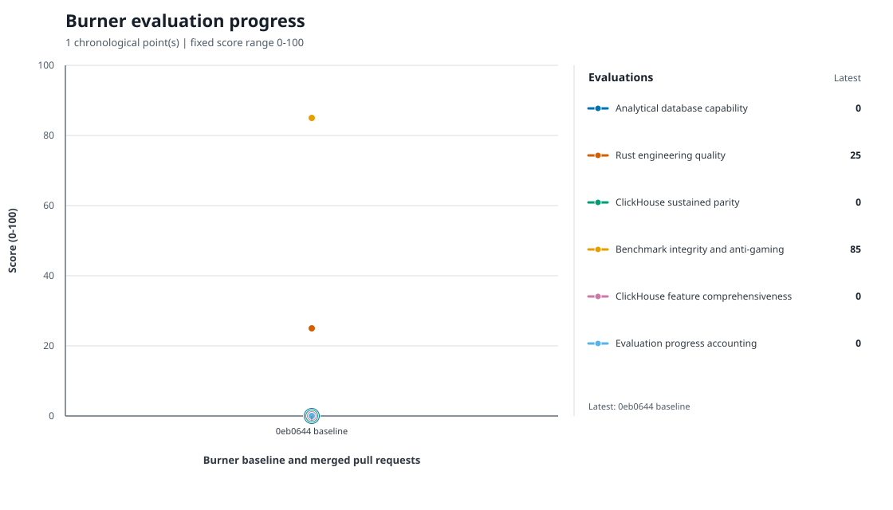

# RustHouse

RustHouse is a from-scratch analytical database in Rust, inspired by the useful core of ClickHouse: typed columnar data, fast scans and aggregations, a practical SQL surface, and an operational interface that is easy to embed and understand.

This is intentionally not a wire-compatible ClickHouse clone. The goal is to grow a credible small competitor through measured, reviewed iterations while keeping the implementation approachable.

## Product target

The first useful release should support:

- typed tables with `Int64`, `Float64`, `Bool`, and `String` columns;
- a genuinely columnar in-memory representation;
- `CREATE TABLE`, `INSERT INTO ... VALUES`, and `SELECT`;
- projections, `WHERE` comparisons, `COUNT`, `SUM`, `MIN`, `MAX`, `AVG`, `GROUP BY`, `ORDER BY`, and `LIMIT`;
- a batch/interactive CLI with readable table, CSV, and JSON output;
- durable local snapshots with an explicit, documented file format;
- an HTTP endpoint for executing SQL;
- deterministic tests and a small benchmark that demonstrate analytical behavior.

The early implementation should favor Rust's standard library and a small dependency surface. Correctness, clear errors, bounded resource use, and a modular path toward vectorized execution matter more than superficial feature count.

## Development model

RustHouse is the dogfood project for [Burner](https://github.com/bobrenjc93/burner). Plain-language repository evaluations establish a baseline. Burner then gives isolated implementation ideas to Codex authors, runs an independent reviewer/author revision loop until approval, reruns the evaluations on the exact candidate branch, and opens impact-stamped pull requests.

```bash
cargo test
cargo run -- --help
```

The repository begins as a deliberately tiny seed. Substantial functionality should arrive through Burner-managed pull requests so the measured history remains visible.

<!-- burner-progress:start -->
## Burner evaluation progress



[Raw versioned evaluation history](docs/burner-evaluation-history.json)

Burner automatically appends one complete point after each Burner-managed pull request merges, keyed by both PR number and merge commit, and regenerates this graph from the raw history. Merge retries cannot create a second point: validation fails on duplicate PRs or commits, missing evaluation scores, malformed values, or scores outside 0-100. Run `python3 scripts/render_burner_evaluation_history.py --check` to verify the committed graph.
<!-- burner-progress:end -->
